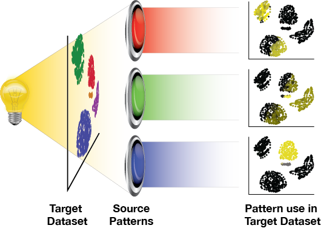

## Overview

## The Maths
Projection can roughly be defined as a mapping or transformation of points from one space to another often lower dimensional space. Mathematically, this can described as a function $\varphi(x)=y : \Re^{D} \mapsto  \Re^{d}$ s.t. $d \leq D$ for $x \in \Re^{D}, y  \in \Re^{d}$ \cite{Barbakh:2009bw}. The projectR package uses projection functions defined in a training dataset to interrogate related biological phenomena in an entirely new data set. 
## Benchmarking